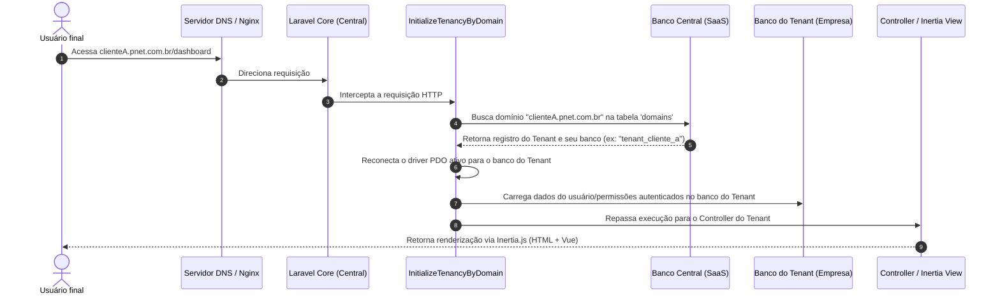

# Guia de Arquitetura de Referência (Sistema PNET)

Este documento descreve a arquitetura técnica, fluxo de dados e decisões de engenharia do **Sistema PNET**. Ele serve como o onboarding oficial para novos desenvolvedores e referência para todo o time.

---

## 1. Stack Tecnológica e Frameworks

O projeto é estruturado utilizando ferramentas modernas do ecossistema PHP e JavaScript:

*   **Backend:** PHP 8.5 + Laravel 13.
*   **Frontend:** Vue 3 (Composition API / Script Setup) + Inertia.js v2 (comunicação SPA sem necessidade de APIs REST tradicionais).
*   **Estilização:** Tailwind CSS v4 (Design System utilitário).
*   **Persistência:** Banco de Dados Relacional (MySQL/PostgreSQL).
*   **Segurança & RBAC:** `spatie/laravel-permission` instalado no escopo de cada Tenant.
*   **Multi-Tenancy:** `stancl/tenancy` v3 (Gerenciamento de múltiplos bancos de dados e domínios).

---

## 2. O Conceito de Multi-Tenancy (Isolamento por Banco)

O PNET utiliza a abordagem **Database-per-Tenant** (um banco de dados físico isolado por cliente). Isso garante máxima segurança de dados, facilidade para backups individualizados e isolamento completo contra vazamento de informações.

### 2.1. Banco Central vs. Banco do Tenant
1.  **Banco Central:** Armazena dados de controle do SaaS. Gerencia quem são os Tenants, seus domínios ativos, planos contratados, cobranças e dados de usuários globais do SaaS Admin.
2.  **Banco do Tenant:** Cada empresa cadastrada possui um banco gerado dinamicamente no setup (ex: `tenant_empresaA`, `tenant_empresaB`). Todas as transações financeiras, contatos, arquivos e logs vivem exclusivamente dentro deste banco.

---

## 3. Ciclo de Vida de uma Requisição (Request Flow)

O diagrama abaixo ilustra como uma requisição vinda do navegador do cliente é resolvida dinamicamente pela aplicação Laravel:



---

## 4. Estrutura de Pastas e Convenções

A estrutura de pastas do Laravel 13 segue o padrão simplificado de controllers e rotas:

```text
sistema-pnet/
├── app/
│   ├── Http/
│   │   ├── Controllers/
│   │   │   ├── Auth/                  # Autenticação central e de tenant
│   │   │   ├── TenantController.php   # Dashboard do tenant
│   │   │   ├── TenantClientController.php
│   │   │   └── ...                    # Outros controllers do Tenant
│   │   └── Middleware/
│   └── Models/                        # Contém tanto models centrais quanto de tenant
├── database/
│   ├── migrations/
│   │   ├── central/                   # Estruturas criadas apenas no Banco Central
│   │   └── tenant/                    # Estruturas criadas no Banco de cada Inquilino
├── resources/
│   └── js/
│       ├── pages/                     # Páginas Vue 3 renderizadas via Inertia.js
│       │   └── tenant/                # Telas internas da operação
│       └── types/                     # Interfaces TypeScript do Frontend
├── routes/
│   ├── web.php                        # Rotas do Domínio Central (ex: cadastro do SaaS)
│   └── tenant.php                     # Rotas de operação (ex: financeiro, drive, contatos)
```

### Convenções Importantes:
*   **Comandos Artisan:** Como o projeto roda em ambiente Dockerizado (Laravel Sail), comandos do Artisan devem ser executados dentro do container utilizando o prefixo `vendor/bin/sail`.
*   **Migrations de Tenant:** Para rodar novas migrations específicas dos tenants, utilize o comando `vendor/bin/sail artisan tenants:migrate`. Nunca rode `artisan migrate` puro se as tabelas pertencerem ao escopo do inquilino.

---

## 5. Segurança e Controle de Acessos (RBAC)

O PNET utiliza a estrutura do Spatie Permissions. O banco de dados do Tenant armazena as permissões e os papéis dos usuários localmente:

*   **Validação no Backend (Middleware):** As rotas sensíveis no arquivo `routes/tenant.php` são protegidas por middlewares que verificam a permissão do usuário logado:
    ```php
    Route::get('/registrations/clients/list', [TenantClientController::class, 'index'])
        ->middleware('permission:registrations.clients.view');
    ```
*   **Validação no Frontend (Vue/Inertia):** As diretivas do frontend recebem as permissões do usuário logado via propriedades globais compartilhadas do Inertia (Share Props). Elementos como botões de edição ou links de exclusão são ocultados dinamicamente baseados nesse payload de permissões.

---

## 6. Isolamento e Armazenamento de Arquivos (Drive)

O armazenamento físico de arquivos e anexos enviados pelos usuários (como comprovantes e documentos cartorários) deve respeitar o isolamento absoluto de diretórios:

*   Os arquivos de cada Tenant são armazenados em um subdiretório exclusivo na pasta de storage baseado no ID ou UUID do Tenant.
*   O caminho raiz de armazenamento é resolvido dinamicamente pela aplicação em tempo de execução, garantindo que o `tenant A` jamais consiga ler ou listar diretórios pertencentes ao `tenant B`.
