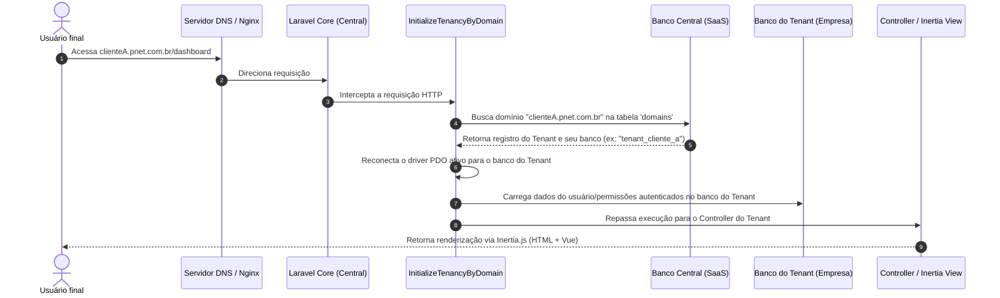

# Guia de Arquitetura de Referência (Sistema PNET)

Este documento descreve a arquitetura técnica, fluxo de dados e decisões de engenharia do **Sistema PNET**. Ele serve como o onboarding oficial para novos desenvolvedores e referência para todo o time.

---

## 1. Stack Tecnológica e Frameworks

O projeto é estruturado utilizando ferramentas modernas do ecossistema PHP e JavaScript:

*   **Backend:** PHP 8.5 + Laravel 13.
*   **Frontend:** Vue 3 (Composition API / Script Setup) + Inertia.js v2 (comunicação SPA sem necessidade de APIs REST tradicionais).
*   **Estilização & Tema:** Tailwind CSS v4 + Shadcn (Design System utilitário com suporte nativo a Modo Escuro / Dark Mode. Veja [dark_mode_guide.md](dark_mode_guide.md)).
*   **Persistência:** Banco de Dados Relacional (MySQL/PostgreSQL).
*   **Segurança & RBAC:** `spatie/laravel-permission` instalado no escopo de cada Tenant.
*   **Multi-Tenancy:** `stancl/tenancy` v3 (Gerenciamento de múltiplos bancos de dados e domínios).

---

## 2. O Conceito de Multi-Tenancy (Isolamento por Banco)

O PNET utiliza a abordagem **Database-per-Tenant** (um banco de dados físico isolado por cliente). Isso garante máxima segurança de dados, facilidade para backups individualizados e isolamento completo contra vazamento de informações.

### 2.1. Banco Central vs. Banco do Tenant
1.  **Banco Central:** Armazena dados de controle do SaaS. Gerencia quem são os Tenants, seus domínios ativos, planos contratados, cobranças e dados de usuários globais do SaaS Admin.
2.  **Banco do Tenant:** Cada empresa cadastrada possui um banco gerado dinamicamente no setup (ex: `tenant_empresaA`, `tenant_empresaB`). Todas as transações financeiras, contatos, arquivos e logs vivem exclusivamente dentro deste banco.

---

## 3. Ciclo de Vida de uma Requisição (Request Flow)

O diagrama abaixo ilustra como uma requisição vinda do navegador do cliente é resolvida dinamicamente pela aplicação Laravel:


```mermaid
sequenceDiagram
    autonumber
    actor Cliente as Usuário final
    participant DNS as Servidor DNS / Nginx
    participant Central as Laravel Core (Central)
    participant Middleware as InitializeTenancyByDomain
    participant DB_Central as Banco Central (SaaS)
    participant DB_Tenant as Banco do Tenant (Empresa)
    participant App as Controller / Inertia View

    Cliente->>DNS: Acessa clienteA.pnet.com.br/dashboard
    DNS->>Central: Direciona requisição
    Central->>Middleware: Intercepta a requisição HTTP
    Middleware->>DB_Central: Busca domínio "clienteA.pnet.com.br" na tabela 'domains'
    DB_Central-->>Middleware: Retorna registro do Tenant e seu banco (ex: "tenant_cliente_a")
    Middleware->>Middleware: Reconecta o driver PDO ativo para o banco do Tenant
    Middleware->>DB_Tenant: Carrega dados do usuário/permissões autenticados no banco do Tenant
    Middleware->>App: Repassa execução para o Controller do Tenant
    App-->>Cliente: Retorna renderização via Inertia.js (HTML + Vue)
```

---

## 4. Estrutura de Pastas e Convenções

A estrutura de pastas do Laravel 13 segue o padrão simplificado de controllers e rotas:

```text
sistema-pnet/
├── app/
│   ├── Actions/
│   │   └── FeeCalculator/             # Fluxos da calculadora (calcular, orçar, vincular, converter)
│   ├── Console/Commands/              # Comandos agendados (alertas de etapa, limpeza de cálculos)
│   ├── Enums/                         # Enums de domínio (status, tipos, cargos)
│   ├── Exceptions/                    # Exceções de domínio (com subpastas por integração)
│   ├── Http/
│   │   ├── Controllers/
│   │   │   ├── Auth/                  # Autenticação central e de tenant
│   │   │   ├── TenantController.php   # Dashboard do tenant
│   │   │   ├── TenantClientController.php
│   │   │   └── ...                    # Outros controllers do Tenant
│   │   ├── Middleware/
│   │   └── Requests/                  # Form Requests (um por operação)
│   ├── Jobs/                          # Jobs de fila (provisionamento, anexar PDF do orçamento)
│   ├── Mail/                          # E-mails em fila (propostas e orçamentos)
│   ├── Models/                        # Contém tanto models centrais quanto de tenant
│   ├── Policies/                      # Regras por registro (Drive, Propostas, Calculadora)
│   ├── Rules/                         # Regras de validação customizadas
│   ├── Services/                      # Regras de negócio e acesso ao banco do tenant
│   │   ├── FeeCalculator/             # Montagem do resultado e das linhas de custo
│   │   ├── Ibge/                      # Cliente da API de municípios do IBGE
│   │   ├── Itbi/                      # Cálculo local do ITBI
│   │   └── RegistryFee/               # Cliente da API de emolumentos
│   └── Support/                       # Utilitários puros (ex.: Money, valores em centavos)
├── config/
│   └── proposals.php                  # Configurações do módulo de Propostas
├── database/
│   ├── migrations/
│   │   ├── central/                   # Estruturas criadas apenas no Banco Central
│   │   └── tenant/                    # Estruturas criadas no Banco de cada Inquilino
├── lang/
│   └── pt_BR/                         # Textos da calculadora (tipos de cálculo, textos legais)
├── resources/
│   ├── js/
│   │   ├── pages/                     # Páginas Vue 3 renderizadas via Inertia.js
│   │   │   └── tenant/                # Telas internas da operação
│   │   └── types/                     # Interfaces TypeScript do Frontend
│   └── views/
│       ├── mail/                      # Templates markdown dos e-mails
│       └── pdf/                       # Templates dos PDFs (dompdf)
├── routes/
│   ├── web.php                        # Rotas do Domínio Central (ex: cadastro do SaaS)
│   ├── tenant.php                     # Rotas de operação (ex: financeiro, drive, contatos)
│   └── console.php                    # Agendamento dos comandos
```

### Convenções Importantes:
*   **Comandos Artisan:** Como o projeto roda em ambiente Dockerizado (Laravel Sail), comandos do Artisan devem ser executados dentro do container utilizando o prefixo `vendor/bin/sail`.
*   **Migrations de Tenant:** Para rodar novas migrations específicas dos tenants, utilize o comando `vendor/bin/sail artisan tenants:migrate`. Nunca rode `artisan migrate` puro se as tabelas pertencerem ao escopo do inquilino.
*   **Migrations Centrais:** ficam em `database/migrations/central` e rodam com `vendor/bin/sail artisan migrate --path=database/migrations/central`.
*   **Fila e Agendador:** e-mails, o provisionamento de tenants e a anexação de PDFs rodam na fila, que precisa de um worker (`queue:work`). A fila restaura o tenant de origem (`QueueTenancyBootstrapper`). Os comandos agendados em `routes/console.php` precisam do `schedule:run`.
*   **Dinheiro:** valores monetários são gravados em centavos (inteiros). No backend, use `App\Support\Money`; no frontend, `formatMoney` (`@/lib/masks`) e o componente `MoneyInput`, que trabalha em centavos.

---

## 5. Segurança e Controle de Acessos (RBAC)

O PNET utiliza a estrutura do Spatie Permissions. O banco de dados do Tenant armazena as permissões e os papéis dos usuários localmente:

*   **Validação no Backend (Middleware):** As rotas sensíveis no arquivo `routes/tenant.php` são protegidas por middlewares que verificam a permissão do usuário logado:
    ```php
    Route::get('/registrations/clients/list', [TenantClientController::class, 'index'])
        ->middleware('permission:registrations.clients.view');
    ```
*   **Validação no Frontend (Vue/Inertia):** As diretivas do frontend recebem as permissões do usuário logado via propriedades globais compartilhadas do Inertia (Share Props). Elementos como botões de edição ou links de exclusão são ocultados dinamicamente baseados nesse payload de permissões.
*   **Regras por registro (Policies):** quando a permissão da rota não basta, porque o acesso depende do registro, uma Policy complementa o middleware: `DrivePolicy`, `ProposalPolicy` (Parceiro, Vendedor do imóvel e Cliente só acessam as próprias propostas) e `FeeCalculationPolicy` (o cálculo só é visível para quem o fez ou para o administrador). As policies usam `checkPermissionTo()`, que retorna `false` em vez de lançar exceção quando a permissão não existe no tenant.
*   **Cargos:** os nomes dos cargos gravados no banco são os rótulos do `RolesEnum` (ex.: `Administrador`, `Parceiro`). O módulo Documentações criou os cargos `Analista` (acesso total ao grupo Documentações), `Cliente` (proponente com acesso às próprias propostas) e `Vendedor do imóvel` (o cargo `Vendedor`, que já existia, é da área de vendas).
*   **Onde as permissões são criadas:** sempre por migration, nunca por seeder. O catálogo central (`permissions`, por módulo) define o que cada plano libera, e cada tenant recebe só as permissões dos seus módulos ativos. Esse filtro é o que faz o plano valer no backend, já que as rotas são protegidas apenas por `permission:`. Toda gravação de cargos e permissões no tenant passa pelo `TenantPermissionService`: o `SeedTenantDatabase` o usa no provisionamento, o comando `tenants:sync-permissions` o usa nos tenants existentes, e as migrations de tenant de permissões novas também. Os módulos core e o catálogo base vêm das migrations centrais `seed_core_modules` e `seed_core_permissions`, que substituíram o `ModuleSeeder`, o `PermissionSeeder` e o `TenantPermissionSeeder`. Detalhes e modelos em [convencoes_de_desenvolvimento.md](../convencoes_de_desenvolvimento.md), seção 9.

---

## 6. Isolamento e Armazenamento de Arquivos (Drive)

O armazenamento físico de arquivos e anexos enviados pelos usuários (como comprovantes e documentos cartorários) deve respeitar o isolamento absoluto de diretórios:

*   Os arquivos de cada Tenant são armazenados em um subdiretório exclusivo na pasta de storage baseado no ID ou UUID do Tenant.
*   O caminho raiz de armazenamento é resolvido dinamicamente pela aplicação em tempo de execução, garantindo que o `tenant A` jamais consiga ler ou listar diretórios pertencentes ao `tenant B`.
*   O disco é definido em `config('bucket.disk')`, e cada módulo usa uma subpasta própria, declarada como constante no service (ex.: `proposals/{id}` para os documentos das propostas).
*   A remoção física do arquivo só acontece depois do commit da transação, para que um rollback nunca deixe registro apontando para arquivo apagado.

---

## 7. Integrações Externas

*   **API de emolumentos (`RegistryFeeApiClient`):** URL e token em `config/services.php` (`registry_fee_calculator`, variáveis `REGISTRY_FEE_CALCULATOR_*`). A API é chamada com timeout e com retry apenas em falha de conexão. Respostas 401/403/404/429 e 5xx viram "indisponível"; uma mensagem de negócio no corpo vira erro de validação para o usuário.
*   **IBGE (`IbgeLocalityClient`):** lista de municípios por UF, em cache.
