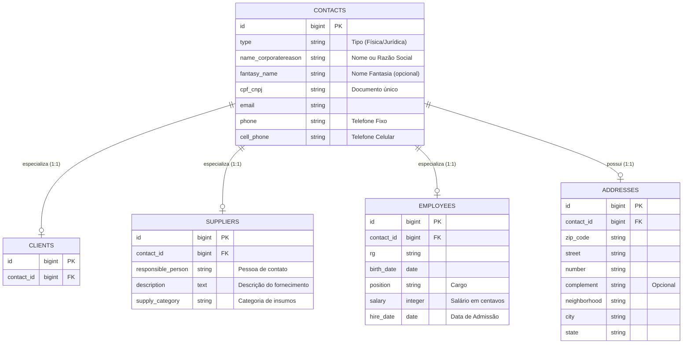
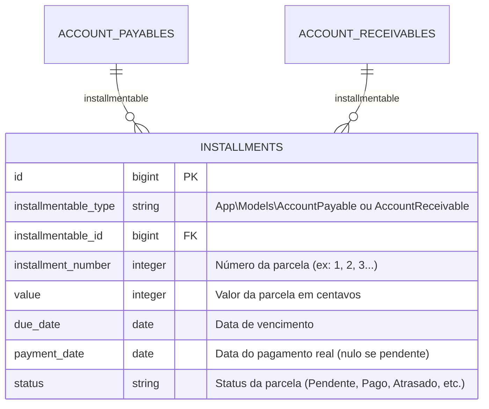

# Detalhamento Técnico dos Módulos Principais (Sistema PNET)

Este documento detalha o funcionamento técnico, a modelagem de banco de dados e as regras de implementação dos módulos de **Cadastros**, **Catálogo** e **Financeiro** da aplicação atual.

---

## 1. Módulo de Cadastros Básicos (Registrations)

O sistema utiliza um modelo de dados de **Contatos Unificados** com especializações por tabelas relacionadas de um para um (1:1).

### 1.1. Modelagem do Banco de Dados

### 1.2. Regras e Endpoints de Cadastros
*   **Contatos Duplicados:** O sistema realiza a busca automática de contatos já cadastrados via endpoint `get-contact-by-cpf-cnpj/{cpf_cnpj}` para evitar duplicidade de registros entre os papéis (ex: um Funcionário ou Fornecedor que também é Cliente).
*   **Permissões de Acesso:** O acesso é controlado individualmente por ações via middlewares de permissão (ex: `permission:registrations.clients.create`, `permission:registrations.suppliers.edit`).

---

## 2. Módulo de Catálogo (Produtos e Serviços)

O catálogo é separado entre bens físicos (Produtos) com controle de estoque e serviços prestados com duração de tempo.

### 2.1. Categoria e Cadastro de Produtos (`products`)
*   **Categorias (`product_categories`):** Possui `name` e `status` (ativo/inativo).
*   **Produtos (`products`):**
    *   `product_category_id` (vínculo obrigatório).
    *   `name`, `sku` (código único de controle de estoque) e `barcode` (código de barras). O par `[sku, barcode]` é único no banco de dados.
    *   `cost_value` e `sell_value` (armazenados como inteiros para evitar problemas de ponto flutuante em centavos).
    *   `manage_stock` (booleano): Define se o sistema deve decrementar o estoque nas saídas.
    *   `current_stock` e `min_stock` (estoque atual e mínimo para alertas).
    *   `unit_of_measure` (Unidade de medida - ex: UN, KG, LT).
    *   `status` (ativo/inativo).

### 2.2. Categoria e Cadastro de Serviços (`services`)
*   **Categorias (`service_categories`):** Possui `name` e `status`.
*   **Serviços (`services`):**
    *   `service_category_id` (vínculo obrigatório).
    *   `name` e `sku` (código único do serviço).
    *   `cost_value` e `sell_value` (valor de custo interno e valor cobrado ao cliente final).
    *   `fees` (taxas ou tributação associada ao serviço).
    *   `duration` (duração estimada em minutos).
    *   `status` (ativo/inativo).

---

## 3. Módulo Financeiro (Finance)

Estrutura altamente integrada baseada em um plano de contas e parcelamentos polimórficos.

### 3.1. Contas Bancárias (`bank_accounts`)
Registra as contas correntes ou caixas internos do tenant para movimentações.
*   Campos: `name`, `bank`, `agency`, `account_number`, `account_type` (ex: Poupança, Corrente), `initial_balance` (saldo inicial de abertura) e `current_balance` (saldo conciliado atual).
*   As contas podem ser marcadas como `main_account` (conta padrão para transações) e devem ser ativas (`active = 1`).
*   A combinação `[bank, agency, account_number]` é única por tenant.

### 3.2. Plano de Contas (`financial_categories` & `financial_subcategories`)
*   **Categorias Financeiras:** Agrupadores que possuem `name`, `type` (Receita/Despesa) e `active`.
*   **Subcategorias Financeiras:** Nível secundário de classificação vinculado de forma obrigatória a uma categoria mãe.

### 3.3. Contas a Pagar (`account_payables`) e Contas a Receber (`account_receivables`)
Ambas as tabelas compartilham exatamente a mesma estrutura física, porém registram fluxos opostos (saídas e entradas).
*   **Campos de Relacionamento:**
    *   `financial_category_id` & `financial_subcategory_id` (Classificação no DRE/Fluxo de caixa).
    *   `bank_account_id` (Conta padrão associada).
    *   `financial_contact_id` (Vínculo com o Cliente/Fornecedor do financeiro).
    *   `cost_id` (Vínculo com a tabela de classificação de custos fixos ou variáveis).
*   **Campos de Controle:**
    *   `description` (texto descritivo da despesa/receita).
    *   `total` (valor total do título).
    *   `payment_method` (forma de pagamento - ex: PIX, Boleto, Cartão).
    *   `payment_condition` (condição - ex: À Vista, Parcelado).
    *   `total_installments` (quantidade total de parcelas geradas).
    *   `receipt` (caminho do anexo de comprovante ou nota fiscal).

### 3.4. Parcelamentos Polimórficos (`installments`)
Em vez de duplicar a lógica de parcelamento para Contas a Pagar e Contas a Receber, o sistema utiliza uma relação polimórfica (`morphs`).

*   **Fluxo de Caixa (`TenantCashFlowController`):** A leitura do fluxo de caixa diário/mensal é consolidada analisando diretamente as datas de vencimento (`due_date`) e pagamento (`payment_date`) da tabela `installments`, e não dos cabeçalhos das contas.
*   **Fluxo de Gastos (`TenantSpendingFlowController`):** Consolida saídas financeiras atreladas a `account_payables` e permite a exportação do relatório financeiro consolidado em PDF.
