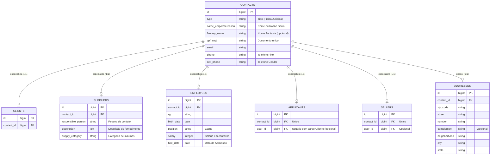
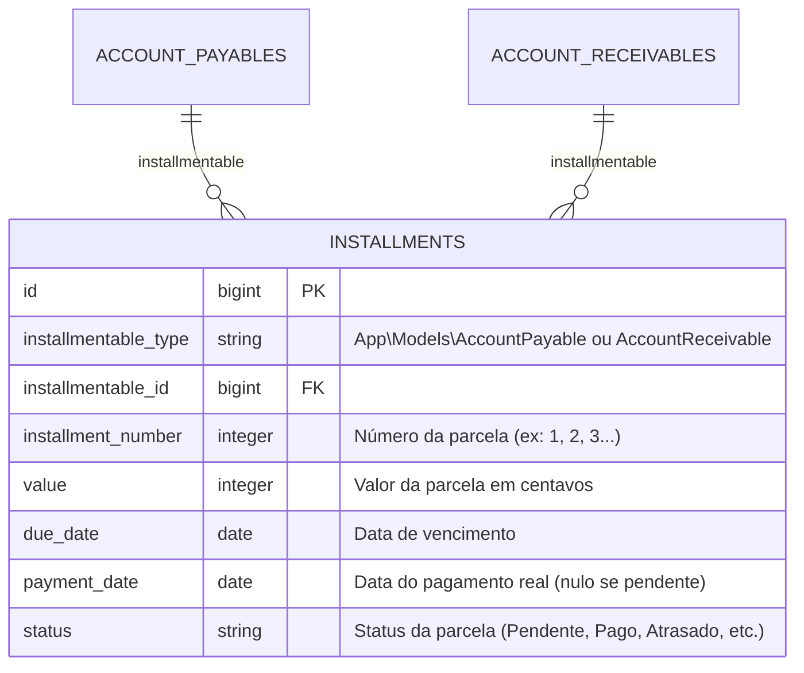
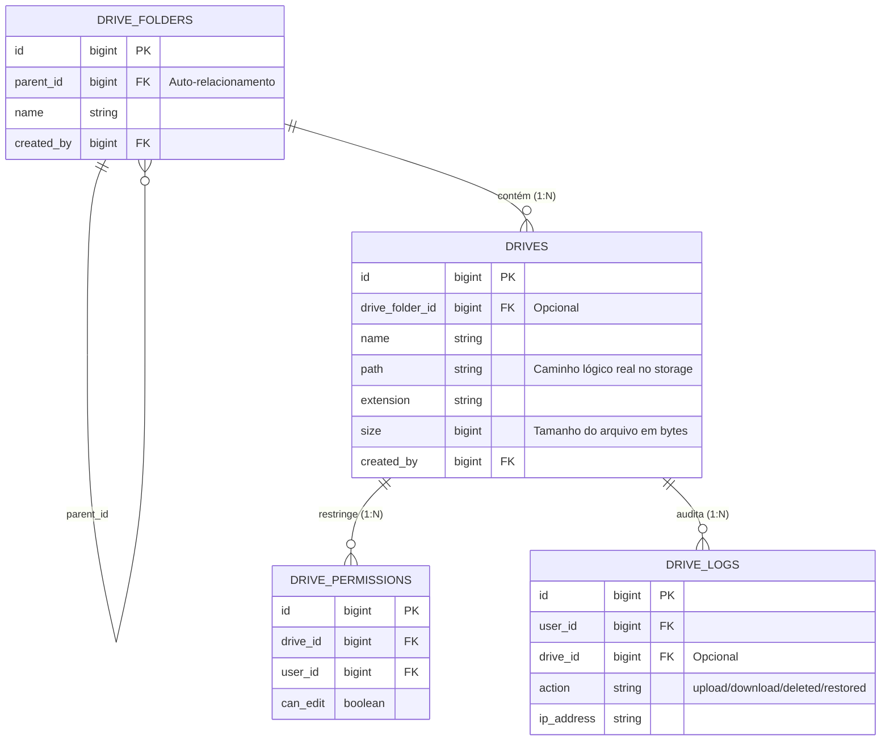
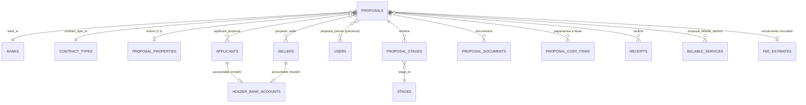

# Detalhamento Técnico dos Módulos Principais (Sistema PNET)

Este documento detalha o funcionamento técnico, a modelagem de banco de dados e as regras de implementação dos módulos de **Cadastros**, **Catálogo**, **Financeiro**, **Drive (Documentos)** e **Documentações** (cadastros auxiliares, propostas e calculadora de emolumentos) da aplicação atual.

---

## 1. Módulo de Cadastros Básicos (Registrations)

O sistema utiliza um modelo de dados de **Contatos Unificados** com especializações por tabelas relacionadas de um para um (1:1).

### 1.1. Modelagem do Banco de Dados

```mermaid
erDiagram
    CONTACTS ||--o| CLIENTS : "especializa (1:1)"
    CONTACTS ||--o| SUPPLIERS : "especializa (1:1)"
    CONTACTS ||--o| EMPLOYEES : "especializa (1:1)"
    CONTACTS ||--o| APPLICANTS : "especializa (1:1)"
    CONTACTS ||--o| SELLERS : "especializa (1:1)"
    CONTACTS ||--o| ADDRESSES : "possui (1:1)"
    
    CONTACTS {
        id bigint PK
        type string "Tipo (Física/Jurídica)"
        name_corporatereason string "Nome ou Razão Social"
        fantasy_name string "Nome Fantasia (opcional)"
        cpf_cnpj string "Documento único"
        email string
        phone string "Telefone Fixo"
        cell_phone string "Telefone Celular"
    }

    ADDRESSES {
        id bigint PK
        contact_id bigint FK
        zip_code string
        street string
        number string
        complement string "Opcional"
        neighborhood string
        city string
        state string
    }

    CLIENTS {
        id bigint PK
        contact_id bigint FK
    }

    SUPPLIERS {
        id bigint PK
        contact_id bigint FK
        responsible_person string "Pessoa de contato"
        description text "Descrição do fornecimento"
        supply_category string "Categoria de insumos"
    }

    EMPLOYEES {
        id bigint PK
        contact_id bigint FK
        rg string
        birth_date date
        position string "Cargo"
        salary integer "Salário em centavos"
        hire_date date "Data de Admissão"
    }

    APPLICANTS {
        id bigint PK
        contact_id bigint FK "Único"
        user_id bigint FK "Usuário com cargo Cliente (opcional)"
    }

    SELLERS {
        id bigint PK
        contact_id bigint FK "Único"
        user_id bigint FK "Opcional"
    }
```

### 1.2. Regras e Endpoints de Cadastros
*   **Contatos Duplicados:** O sistema realiza a busca automática de contatos já cadastrados via endpoint `get-contact-by-cpf-cnpj/{cpf_cnpj}` para evitar duplicidade de registros entre os papéis (ex: um Funcionário ou Fornecedor que também é Cliente).
*   **Proponentes e Vendedores do imóvel:** `applicants` e `sellers` são papéis do mesmo hub `contacts`, usados pelo módulo de Propostas (ver seção 5). A antiga tabela `proponents` foi removida. Os campos completos estão na seção 5.2.
*   **Permissões de Acesso:** O acesso é controlado individualmente por ações via middlewares de permissão (ex: `permission:registrations.clients.create`, `permission:registrations.suppliers.edit`).

---

## 2. Módulo de Catálogo (Produtos e Serviços)

O catálogo é separado entre bens físicos (Produtos) com controle de estoque e serviços prestados com duração de tempo.

### 2.1. Categoria e Cadastro de Produtos (`products`)
*   **Categorias (`product_categories`):** Possui `name` e `status` (ativo/inativo).
*   **Produtos (`products`):**
    *   `product_category_id` (vínculo obrigatório).
    *   `name`, `sku` (código único de controle de estoque) e `barcode` (código de barras). O par `[sku, barcode]` é único no banco de dados.
    *   `cost_value` e `sell_value` (armazenados como inteiros para evitar problemas de ponto flutuante em centavos).
    *   `manage_stock` (booleano): Define se o sistema deve decrementar o estoque nas saídas.
    *   `current_stock` e `min_stock` (estoque atual e mínimo para alertas).
    *   `unit_of_measure` (Unidade de medida - ex: UN, KG, LT).
    *   `status` (ativo/inativo).

### 2.2. Categoria e Cadastro de Serviços (`services`)
*   **Categorias (`service_categories`):** Possui `name` e `status`.
*   **Serviços (`services`):**
    *   `service_category_id` (vínculo obrigatório).
    *   `name` e `sku` (código único do serviço).
    *   `cost_value` e `sell_value` (valor de custo interno e valor cobrado ao cliente final).
    *   `fees` (taxas ou tributação associada ao serviço).
    *   `duration` (duração estimada em minutos).
    *   `status` (ativo/inativo).

---

## 3. Módulo Financeiro (Finance)

Estrutura altamente integrada baseada em um plano de contas e parcelamentos polimórficos.

### 3.1. Contas Bancárias (`bank_accounts`)
Registra as contas correntes ou caixas internos do tenant para movimentações.
*   Campos: `name`, `bank`, `agency`, `account_number`, `account_type` (ex: Poupança, Corrente), `initial_balance` (saldo inicial de abertura) e `current_balance` (saldo conciliado atual).
*   As contas podem ser marcadas como `main_account` (conta padrão para transações) e devem ser ativas (`active = 1`).
*   A combinação `[bank, agency, account_number]` é única por tenant.

### 3.2. Plano de Contas (`financial_categories` & `financial_subcategories`)
*   **Categorias Financeiras:** Agrupadores que possuem `name`, `type` (Receita/Despesa) e `active`.
*   **Subcategorias Financeiras:** Nível secundário de classificação vinculado de forma obrigatória a uma categoria mãe.

### 3.3. Contas a Pagar (`account_payables`) e Contas a Receber (`account_receivables`)
Ambas as tabelas compartilham exatamente a mesma estrutura física, porém registram fluxos opostos (saídas e entradas).
*   **Campos de Relacionamento:**
    *   `financial_category_id` & `financial_subcategory_id` (Classificação no DRE/Fluxo de caixa).
    *   `bank_account_id` (Conta padrão associada).
    *   `financial_contact_id` (Vínculo com o Cliente/Fornecedor do financeiro).
    *   `cost_id` (Vínculo com `cost_types`, o cadastro de Tipos de Custo. A tabela se chamava `costs` e foi renomeada, com a coluna `type` virando `name`; o nome da FK foi mantido).
*   **Campos de Controle:**
    *   `description` (texto descritivo da despesa/receita).
    *   `total` (valor total do título).
    *   `payment_method` (forma de pagamento - ex: PIX, Boleto, Cartão).
    *   `payment_condition` (condição - ex: À Vista, Parcelado).
    *   `total_installments` (quantidade total de parcelas geradas).
    *   `receipt` (caminho do anexo de comprovante ou nota fiscal).

### 3.4. Parcelamentos Polimórficos (`installments`)
Em vez de duplicar a lógica de parcelamento para Contas a Pagar e Contas a Receber, o sistema utiliza uma relação polimórfica (`morphs`).

```mermaid
erDiagram
    ACCOUNT_PAYABLES ||--o{ INSTALLMENTS : "installmentable"
    ACCOUNT_RECEIVABLES ||--o{ INSTALLMENTS : "installmentable"
    
    INSTALLMENTS {
        id bigint PK
        installmentable_type string "App\\Models\\AccountPayable ou AccountReceivable"
        installmentable_id bigint FK
        installment_number integer "Número da parcela (ex: 1, 2, 3...)"
        value integer "Valor da parcela em centavos"
        due_date date "Data de vencimento"
        payment_date date "Data do pagamento real (nulo se pendente)"
        status string "Status da parcela (Pendente, Pago, Atrasado, etc.)"
    }
```

*   **Fluxo de Caixa (`TenantCashFlowController`):** A leitura do fluxo de caixa diário/mensal é consolidada analisando diretamente as datas de vencimento (`due_date`) e pagamento (`payment_date`) da tabela `installments`, e não dos cabeçalhos das contas.
*   **Fluxo de Gastos (`TenantSpendingFlowController`):** Consolida saídas financeiras atreladas a `account_payables` e permite a exportação do relatório financeiro consolidado em PDF.

---

## 4. Módulo de Gestão de Documentos (Drive)

O sistema de arquivos gerencia a organização física e lógica de documentos, contendo pastas dinâmicas, controle de permissões por usuário (ACL) e auditoria de ações de download/upload.

### 4.1. Modelagem do Banco de Dados

```mermaid
erDiagram
    DRIVE_FOLDERS ||--o{ DRIVE_FOLDERS : "parent_id"
    DRIVE_FOLDERS ||--o{ DRIVES : "contém (1:N)"
    DRIVES ||--o{ DRIVE_PERMISSIONS : "restringe (1:N)"
    DRIVES ||--o{ DRIVE_LOGS : "audita (1:N)"
    
    DRIVE_FOLDERS {
        id bigint PK
        parent_id bigint FK "Auto-relacionamento"
        name string
        created_by bigint FK
    }

    DRIVES {
        id bigint PK
        drive_folder_id bigint FK "Opcional"
        name string
        path string "Caminho lógico real no storage"
        extension string
        size bigint "Tamanho do arquivo em bytes"
        created_by bigint FK
    }

    DRIVE_PERMISSIONS {
        id bigint PK
        drive_id bigint FK
        user_id bigint FK
        can_edit boolean
    }

    DRIVE_LOGS {
        id bigint PK
        user_id bigint FK
        drive_id bigint FK "Opcional"
        action string "upload/download/deleted/restored"
        ip_address string
    }
```

### 4.2. Regras e Endpoints de Documentos
*   **Isolamento Físico de Storage:** Arquivos são salvos em subdiretórios baseados no ID do Tenant para evitar o compartilhamento não autorizado de arquivos físicos.
*   **Controle de Acesso ACL:** Ao realizar download, a rota `/drive/{id}/download` executa um check de segurança na tabela `drive_permissions`. Se o usuário atual não for o criador do arquivo (`created_by`) e não possuir uma flag ativa na tabela de permissões, o download é abortado com erro HTTP `403`.
*   **Auditoria de Arquivos:** Todo upload, download ou deleção lógica insere um log na tabela `drive_logs` com fins de segurança e rastreamento.

---

## 5. Módulo Documentações (Cadastros auxiliares, Propostas e Calculadora)

Grupo "Documentações" do menu, implementado a partir dos PRDs em `docs/prd/`. Todas as tabelas vivem no **banco do tenant**. Valores em dinheiro são `unsignedBigInteger` em **centavos**; percentuais de ITBI são `decimal(7,4)`.

### 5.1. Cadastros auxiliares

Todos usam `softDeletes`. Excluir um cadastro em uso não quebra os registros que apontam para ele: as relações carregam o item com `withTrashed()`, e a listagem mostra a contagem de uso (`in_use_count`). Itens excluídos podem ser restaurados.

| Tabela | Campos principais | Observações |
| :--- | :--- | :--- |
| `banks` | `name` (único) | Usado por propostas e orçamentos. Semeado com a lista inicial (`BankSeeder`). |
| `notaries` | `name`, endereço (`zip_code`, `street`, `number`, `complement`, `neighborhood`, `city`, `state`), `reference_point`, `business_hours` | Usado nas linhas de custo da proposta. |
| `contract_types` | `name` (único), `requires_financing` | Semeado com os ids do sistema de origem (`ContractTypeSeeder`). O id padrão do orçamento convertido vem de `config('proposals.default_contract_type_id')`. |
| `cost_types` | `name`, `requires_notary`, `receipt_type` (`general` / `advisory` / `courier`) | Antiga `costs` do financeiro, renomeada. Compartilhada entre o Financeiro e as Propostas. |
| `property_types` | `name` (único), `shows_number`, `shows_complement`, `requires_development`, `shows_unit`, `shows_block` | As flags controlam os campos do imóvel na proposta. |
| `developments` | `name` (único) | Empreendimentos. |
| `stages` | `order`, `name`, `has_date`, `date_required`, `has_upload`, `upload_required`, `title_required`, `notes_required`, `completion_deadline_hours`, `alert_deadline_hours`, `shows_property_data`, `shows_registry_protocol` | Etapas da timeline, reordenáveis. Semeadas com 8 etapas padrão (`StageSeeder`). |
| `billable_services` | `name`, `description`, `price`, `generates_receipt` | Serviços cobráveis, vinculados a propostas e orçamentos com valor negociado próprio. |

### 5.2. Propostas

```mermaid
erDiagram
    PROPOSALS }o--|| BANKS : "bank_id"
    PROPOSALS }o--|| CONTRACT_TYPES : "contract_type_id"
    PROPOSALS ||--o| PROPOSAL_PROPERTIES : "imóvel (1:1)"
    PROPOSALS }o--o{ APPLICANTS : "applicant_proposal"
    PROPOSALS }o--o{ SELLERS : "proposal_seller"
    PROPOSALS }o--o{ USERS : "proposal_partner (parceiros)"
    PROPOSALS ||--o{ PROPOSAL_STAGES : "timeline"
    PROPOSALS ||--o{ PROPOSAL_DOCUMENTS : "documentos"
    PROPOSALS ||--o{ PROPOSAL_COST_ITEMS : "pagamentos e taxas"
    PROPOSALS ||--o{ RECEIPTS : "recibos"
    PROPOSALS }o--o{ BILLABLE_SERVICES : "proposal_billable_service"
    PROPOSALS ||--o| FEE_ESTIMATES : "emolumento vinculado"
    PROPOSAL_STAGES }o--|| STAGES : "stage_id"
    APPLICANTS ||--o| HOLDER_BANK_ACCOUNTS : "accountable (morph)"
    SELLERS ||--o| HOLDER_BANK_ACCOUNTS : "accountable (morph)"
```

*   **`proposals`:** `creator_id`, `analyst_id` (padrão: o criador), `bank_id`, `contract_type_id`, `status` (`new`, `in_progress`, `awaiting_property`, `canceled`, `finished`, `restricted`), `amortization_table`, `property_condition`, valores em centavos (`purchase_value`, `down_payment_value`, `financing_value`, `expenses_value`, `subsidy_value`, `financed_value`, `intended_installment_value`, `fgts_value`, `documentation_fee_to_finance`, `declared_income`), flags (`uses_fgts`, `is_first_financing`, `finance_documentation_fee`, `declares_income_tax`, `has_other_property`), `payment_term`, previsão de entrega (`expected_delivery_month` / `expected_delivery_year`), motivos (`cancellation_reason`, `restriction_reason`), observações em texto, `particularities` e `finished_at`. Usa soft delete. O número exibido é o id com 5 dígitos.
*   **`applicants`:** proponente sobre `contacts` (`contact_id` único), com `user_id` (usuário com cargo **Cliente**, criado no primeiro cadastro), `birth_date`, `marital_status`, `profession`, `family_income`, `declared_income`, `declares_income_tax`, `income_tax_notes`, `by_power_of_attorney`. O proponente é reaproveitado pelo CPF.
*   **`sellers`:** vendedor do imóvel sobre `contacts` (PF ou PJ), com `user_id`, `creator_id` e os mesmos dados de renda e estado civil.
*   **`holder_bank_accounts`:** conta bancária do proponente ou vendedor (`morphs('accountable')`, uma por titular), com `bank_name`, `account_type` (0 = poupança, 1 = corrente), `branch`, `number`, `notes`. É separada de `bank_accounts`, que pertence ao financeiro.
*   **`proposal_properties`:** imóvel da proposta (1:1), com `property_type_id`, `development_id`, `address`, `number`, `complement`, `block`, `unit`.
*   **`proposal_stages`:** cópia das etapas para a proposta, com `position`, `is_current`, `started_at`, `completed_at`, `date`, `notes` e `proposal_document_id` (anexo da etapa).
*   **`proposal_documents`:** arquivos da proposta, com `owner` (`buyer`, `seller`, `property`, `stage`, `general`), `documentable` (morph opcional: proponente ou vendedor), `proposal_stage_id`, `type` (enum `DocumentType`), `title`, `disk`, `path`, `original_name`, `mime_type`, `size` e `uploaded_by`.
*   **`proposal_cost_items`:** linhas de pagamentos e taxas, com `type` (`emolument`, `extra_fee`, `service`, `itbi`, `manual`), `amount`, `description`, `extra_fee_description`, `service_description`, `generates_receipt`, `cost_type_id`, `notary_id`, `date`, `notes`, `bill_path` (boleto) e `proof_path` (comprovante). Só as linhas `manual` podem ser removidas.
*   **`receipts`:** recibos, com `type` (`general`, `advisory`, `courier`), `proposal_cost_item_id` (opcional), `name`, `document`, `registration_number`, `notary_name` (cópia do nome no momento da emissão), `total_spent`, `amount_deposited`, `date`.

### 5.3. Calculadora de Emolumentos e Orçamentos

*   **`itbi_municipalities`:** municípios com ITBI configurado, com `name`, `state`, `ibge_code` (único), `module` (`financed_cap`, `value_brackets`, `first_property_rate`, `standard`) e `full_rate`. Trocar o módulo apaga os parâmetros do módulo anterior.
*   **`itbi_rates`:** alíquotas do município (1:1), com `own_funds_rate`, `financed_rate`, `financed_cap_amount`, `first_property_financed_rate`, `other_property_financed_rate`.
*   **`itbi_brackets`:** faixas de valor (módulo `value_brackets`), com `min_value`, `max_value`, `rate`, `discount_amount`, sem sobreposição entre faixas.
*   **`fee_calculations`:** registro do resultado de um cálculo (id **UUID**), com `user_id`, `type`, `state`, `municipality_ibge_code`, `municipality_name`, `input` (json), `api_result` (json com a resposta bruta da API, em reais, convertida para centavos na leitura por `RegistryFeeResult`), `fees_total`, `itbi_amount` e `expires_at`. Fica no servidor, e o navegador só carrega o id. Expira em 7 dias e é limpo pelo comando `fee-calculations:prune`.
*   **`quotes`:** orçamento, com `created_by`, dados do cliente (`name`, `cpf`, `email`, `phone`, `profession`, `marital_status`) e `bank_id`. Usa soft delete. O status (`open`, `expired`, `converted`) é calculado a partir de `fee_estimates`.
*   **`quote_billable_service`:** serviços do orçamento com o valor negociado (`amount`).
*   **`fee_estimates`:** registro permanente do cálculo vinculado a um orçamento (`quote_id`, único) e/ou a uma proposta (`proposal_id`, único), com `type`, `state`, `municipality_name`, `valid_until` (nulo quando vinculado direto à proposta), `api_result`, `fees_total`, `itbi_amount`. Uma proposta só pode ter um emolumento vinculado.

### 5.4. Regras técnicas
*   **Arquivos:** documentos, boletos e comprovantes ficam no disco `config('bucket.disk')`, sob `proposals/{id}`, com limite de upload em `config('bucket.proposal_document_max_kb')`. O arquivo só é removido do disco depois do commit.
*   **API de emolumentos:** cliente `RegistryFeeApiClient` (configurado em `config/services.php`, chave `registry_fee_calculator`). Os valores são enviados em reais inteiros e a resposta é convertida para centavos. O ITBI é calculado localmente (`ItbiCalculator`) antes da chamada à API.
*   **Municípios:** lista do IBGE (`IbgeLocalityClient`), em cache por UF.
*   **E-mails e PDFs:** todos os e-mails vão para a fila e só saem após o commit. Os PDFs são gerados com dompdf. O e-mail do orçamento leva o PDF anexado, gerado no momento do envio. Na conversão em proposta, o job `AttachQuotePdfToProposal` anexa o PDF aos documentos da proposta.
*   **Agendamentos:** `proposals:alert-overdue-stages` (dias úteis, às 07:00) e `fee-calculations:prune` (diário).
