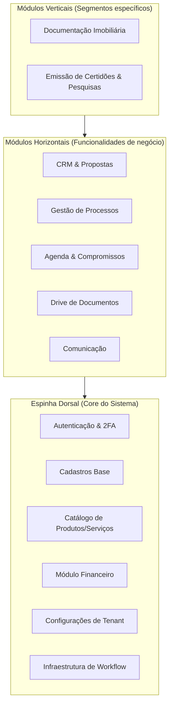

# Visão Geral do Projeto (Sistema PNET)

Este documento define a visão estratégica, arquitetura conceitual e os objetivos de negócio do **Sistema PNET**, servindo como guia para o planejamento de sprints e desenvolvimento do produto.

---

## 1. O que é o Sistema PNET?
O PNET é uma **plataforma SaaS modular de gestão operacional e administrativa** voltada para empresas de serviços e operações. Ele foi desenhado sob uma arquitetura de microsserviços conceituais/módulos acopláveis e suporte nativo a multi-tenancy (isolamento completo de dados por cliente).

---

## 2. Objetivos do Projeto
*   **Modularidade & Multi-tenancy:** Evoluir a plataforma para um produto SaaS modular, multi-tenant e orientado a processos, capaz de atender diferentes segmentos de negócio a partir de uma espinha dorsal comum.
*   **Separação de Responsabilidades:** Garantir separação clara de responsabilidades entre camadas e módulos, reduzindo acoplamento e facilitando manutenção, testes e evolução contínua.
*   **Extensibilidade:** Permitir integrações com sistemas externos e a expansão do ecossistema (apps, portais, parceiros), sem comprometer a estabilidade do core da plataforma.
*   **Escalabilidade & Previsibilidade:** Sustentar o crescimento do produto em número de clientes, módulos e casos de uso, mantendo previsibilidade técnica e operacional.

---

## 3. Pilares de Arquitetura do Produto

O sistema é dividido estruturalmente em três camadas modulares:

### 3.1. Espinha Dorsal (Core)
A base reutilizável que todo inquilino (tenant) possui ativa ao assinar a plataforma:
*   **Autenticação & Segurança:** Controle de acesso com suporte a MFA/2FA e controle de permissões granular (RBAC).
*   **Cadastros Base:** Contatos unificados (Clientes, Fornecedores, Funcionários e Endereços).
*   **Catálogo:** Cadastro unificado de Produtos e Serviços prestados.
*   **Financeiro:** Plano de contas, fluxo de caixa, contas a pagar/receber e conciliação bancária.
*   **Configurações:** Customizações específicas por empresa.
*   **Workflow:** Motor básico para movimentação de status e etapas.

### 3.2. Módulos Horizontais (Expansões de Negócio)
Funcionalidades genéricas acopláveis sobre o Core:
*   **CRM / Propostas:** Captação de novos clientes e propostas comerciais.
*   **Processos (Workflows avançados):** Acompanhamento de projetos e tarefas internas.
*   **Documentos (Drive):** Gerenciamento, controle de versão e assinatura de arquivos.
*   **Agenda & Comunicação:** Ponto de contato e calendário integrado.

### 3.3. Módulos Verticais (Segmentação de Mercado)
Funcionalidades ultra-específicas para nichos de mercado (o grande diferencial competitivo do SaaS):
*   **Documentação Imobiliária:** Fluxos de análise de contratos, due diligence e regularização de imóveis.
*   **Emissão de Certidões & Pesquisas Completas:** Integração com órgãos emissores e automatização de buscas de certidões cartorárias e judiciais.

---

## 4. Interfaces de Usuário (Canais)

1.  **Painel Interno (Web Principal):** Utilizado pelos colaboradores da empresa assinante do SaaS (backoffice) para operar os processos, financeiro e cadastros.
2.  **Portal do Cliente (Opcional):** Um portal restrito para os clientes finais dos tenants acompanharem o andamento de seus processos, enviarem documentos solicitados e interagirem diretamente com os fluxos operacionais sem precisar de canais externos (e-mail/WhatsApp).

---

## 5. Diretrizes Técnicas
*   **Separação de Conceitos:** Separação clara entre backend (Laravel APIs/Controllers), frontend (Vue + Inertia de alta performance) e banco de dados isolado por inquilino (`database-per-tenant`) para garantir a LGPD e a segurança de dados.
*   **Escalabilidade:** Módulos projetados de forma independente para que no futuro possam evoluir como microsserviços ou pacotes isolados caso necessário.
